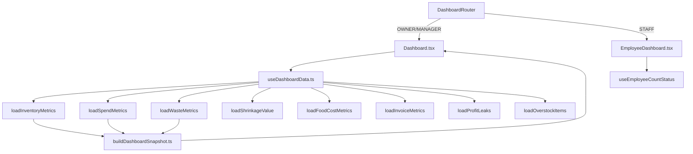

# 01 — System Architecture

**Verified from:** `package.json`, `src/main.tsx`, `src/App.tsx`, migrations, edge functions.

---

## Technology stack (verified versions)

| Layer | Technology | Version (package.json) |
|-------|------------|------------------------|
| UI | React | ^18.3.1 |
| Language | TypeScript | ^5.8.3 |
| Bundler | Vite | ^5.4.19 |
| Routing | react-router-dom | ^6.30.1 |
| Server state | @tanstack/react-query | ^5.83.0 |
| Backend | Supabase JS | ^2.95.3 |
| DB | PostgreSQL (via Supabase) | — |
| Unit tests | Vitest | ^3.2.4 |
| E2E | Playwright | ^1.59.1 |
| Styling | Tailwind CSS | ^3.4.17 |

---

## Frontend architecture

```
src/main.tsx
  └── App.tsx
        ├── AuthProvider (AuthContext)
        ├── RestaurantProvider (RestaurantContext)
        ├── DemoRoleProvider (demo-only role override)
        └── React Router
              ├── Public pages (Landing, Login, Signup, …)
              └── /app → ProtectedRoute → AppLayout
                    ├── AppSidebar (role-filtered nav)
                    ├── AppHeader (restaurant/location switcher)
                    └── Outlet → lazy-loaded pages
```

**Layering convention (partially enforced):**
- `src/pages/` — route components (some oversized: `Dashboard.tsx`, `Settings.tsx` 1600+ lines)
- `src/domain/` — pure business logic and Supabase orchestration loaders (78 files)
- `src/hooks/` — React hooks composing domain + UI state
- `src/features/` — feature slices (inventory-count, invoice-review)
- `src/data/` — fetch/insert helpers (e.g. `fetchInvoiceReviewDoc.ts`)
- `src/components/` — shared UI
- `src/integrations/supabase/` — client + generated types

**Query client defaults** (`App.tsx`): 5min staleTime, 1 retry, no refetch on focus.

---

## Backend architecture (Supabase)

| Component | Count | Location |
|-----------|-------|----------|
| Migrations | 131 | `supabase/migrations/` |
| Edge Functions | 12 | `supabase/functions/*/index.ts` |
| SQL tests | 6 | `supabase/tests/` |
| RLS policies (CREATE statements) | 466 | across migrations |

### Edge Functions

| Function | Purpose |
|----------|---------|
| `send-invite` | Mint/resend team invites (service role) |
| `parse-invoice` | Claude AI extraction (JWT or service role) |
| `inbound-invoice-email` | Resend webhook → draft invoice + parse |
| `dispatch-app-notifications` | Email for count/smart-order events |
| `process-notifications` | Cron: digest, shrink alerts, weekly digest |
| `create-checkout-session` | Stripe checkout |
| `stripe-webhook` | Subscription state updates |
| `send-email` | Generic email sender |
| `vendor-import-invoices` | **Mock** vendor list |
| `vendor-import-invoice-details` | **Mock** vendor detail |
| `audit-invoice-anon` | Public leak audit (no DB writes) |
| `portfolio-dashboard` | Multi-restaurant aggregation |

---

## Authentication

- **Provider:** Supabase Auth (`src/contexts/AuthContext.tsx`)
- **Session:** `onAuthStateChange` → `session` / `user`
- **Profile bootstrap:** `handle_new_user()` trigger → `profiles` table
- **Protected routes:** `ProtectedRoute` redirects unauthenticated → `/login`; zero restaurants → `/demo`

---

## Membership model

```
auth.users
  → profiles
  → restaurant_members (user_id, restaurant_id, role: app_role)
       → restaurants
            → locations
            → user_location_assignments (per-location role + permission flags)
            → user_ui_state (selected restaurant/location persistence)
```

**Canonical role source:** `restaurant_members.role`  
**Location permissions:** `user_location_assignments` (MANAGER/STAFF only; OWNER short-circuits in hook)

---

## Location scoping

| Mechanism | File / object |
|-----------|---------------|
| Client hook | `useLocationPermissions.ts` |
| Client query helper | `withLocationOrNull` (`locationQueryScope.ts`) |
| SQL helpers | `user_accessible_location_ids`, `user_can_access_location`, `has_location_permission` |
| RLS (partial) | Many child tables use `user_can_access_location`; **`locations` table does not** |

---

## Data flow (owner dashboard)



---

## Important domain modules

| Module | Path | Responsibility |
|--------|------|----------------|
| Inventory workflow | `domain/inventory/sessionWorkflow.ts` | Count lifecycle |
| Case planning | `domain/inventory/casePlanningEngine.ts` | Order qty, overstock, inventory value |
| Smart order | `domain/inventory/smartOrderFromSession.ts` | Run generation on approval |
| Invoices | `domain/invoices/*` | Parsing helpers, comparison, receiving validation |
| Dashboard loaders | `domain/dashboard/load*.ts` | KPI data orchestration |
| Notifications | `domain/notifications/*` | Client-allowed + edge dispatch |
| Invites | `domain/invites/sendTeamInvite.ts` | Edge function wrapper |
| Waste | `domain/waste/recordedWasteValue.ts` | Canonical waste $ |
| Subscription | `domain/subscription/resolveEntitlement.ts` | Trial/active gating |

---

## Deployment (verified artifacts)

- **CI:** `.github/workflows/ci.yml` — lint, typecheck, unit test, build (no E2E)
- **Build output:** `dist/` via `vite build` (succeeds)
- **Node version:** `.nvmrc` referenced in CI

---

## Architecture gaps vs stated principles

| Principle | Current state |
|-----------|---------------|
| One shared business engine | **Mostly yes** — domain modules exist; some inline logic in pages |
| Role-specific UI | **Partial** — STAFF dashboard split; MANAGER shares owner dashboard |
| RLS enforcement | **Partial** — location leak on `locations`; UI-only cost gating on most KPIs |
| Financial data not fetched when denied | **Partial** — STAFF protected; MANAGER without `can_see_costs` still loads spend KPIs |
| Auditable actions | **Partial** — RPCs for approval/receipt; direct table writes for count submit |
