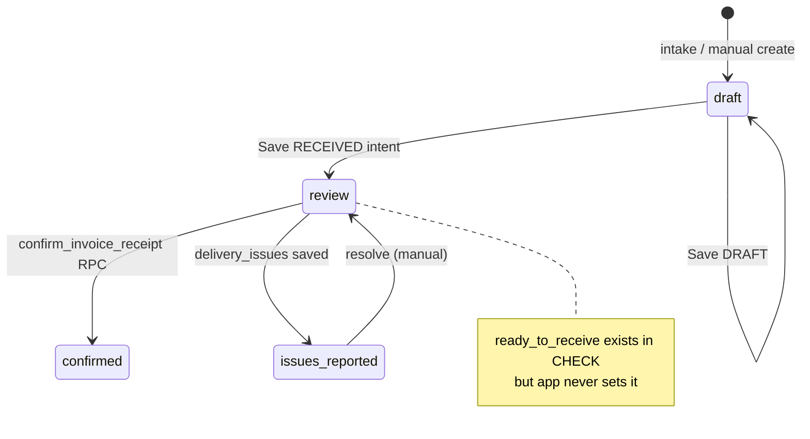

# 07 — Invoice System

Complete trace of invoice processing investment.

---

## Lifecycle diagram

**Parallel legacy path:** `purchase_history` + `purchase_history_items` — review via same UI fallback (`fetchInvoiceReviewDoc.ts`).

---

## Intake channels

| Channel | Status | Files |
|---------|--------|-------|
| Manual entry | **Real** | `Invoices.tsx`, `useInvoiceActions.handleSaveInvoice` |
| PDF/image upload | **Real** | Storage `invoice-uploads`, `parse-invoice` edge fn (Claude Sonnet) |
| CSV/XLSX | **Real** | `normalizeSpreadsheetRows` + `matchRawInvoiceLinesStrong` |
| Email (Resend webhook) | **Real (ops-dependent)** | `inbound-invoice-email/index.ts` |
| Vendor API import | **Mock** | `vendor-import-invoices` returns `is_mock: true` |
| Camera capture | **Real** | `handleCapturedPhoto` → parse pipeline |

---

## Parsing

| Aspect | Detail |
|--------|--------|
| Engine | Anthropic Claude via `parse-invoice` edge function |
| Auth | User JWT + restaurant membership OR service role (email path) |
| Output | vendor, number, date, line items, totals |
| Strong matching | SKU-only — `strongMatchInvoiceItems.ts` (no fuzzy names) |
| Review matching | `resolveInvoiceLineCatalogMatchReview` |
| Image prep | `normalizeImageOrientation.ts` (EXIF) |

**AI-based:** PDF/image parse  
**Rule-based:** Spreadsheet normalize, comparison status, receiving validation

---

## Storage & audit trail

| Object | Table / bucket |
|--------|----------------|
| PDF/files | Supabase storage + `invoice_ingestions` |
| Invoice header | `invoices` |
| Lines | `invoice_items` |
| Comparisons | `invoice_line_comparisons` |
| Issues | `delivery_issues` |
| Stock | `stock_movements` (on confirm) |

---

## Review UI

**Page:** `InvoiceReview.tsx`  
**Data hook:** `useInvoiceReviewData` → `fetchInvoiceReviewDoc`  
**First visit:** `insertComparisonRows` from `buildComparisonRows`

### Three-way match fields (comparison row)

- PO qty/cost vs invoiced vs **received_qty** (Phase 4 trusted receiving)
- `received_qty_confirmed` must be true before post
- Status derived via `deriveInvoiceComparisonStatus` (`lib/invoice-comparison.ts`)

### Manager actions

| Action | Function | Tables |
|--------|----------|--------|
| Edit received qty | `persistReceivedQty` | invoice_line_comparisons |
| Confirm all received | `handleConfirmAllReceivedQty` | invoice_line_comparisons |
| Map catalog item | `handleSaveMapping` | invoice_items, comparisons |
| Report issue | `handleSaveIssue` | delivery_issues, invoices.receipt_status |
| Post receipt | `handleConfirmReceipt` | RPC → invoices, stock_movements, catalog |

---

## Receipt confirmation (`confirm_invoice_receipt`)

**Caller:** `useInvoiceReviewActions.ts` (sole frontend caller)

**Server gates (migrations):**
- `can_confirm_receipt(auth.uid(), restaurant_id)` — OWNER or MANAGER
- Unconfirmed received qty blocked
- Idempotent receive per invoice line (unique index on stock_movements)

**Effects (RPC — verified from migrations, not re-run):**
- `invoices.status = confirmed`, `receipt_status = confirmed`
- Insert `stock_movements` type `receive`
- Update catalog default unit costs
- Create `PRICE_INCREASE` notifications

**Legacy:** Delegates to `confirm_invoice_receipt_legacy` for `purchase_history` IDs

---

## Price change detection

| Source | Mechanism |
|--------|-----------|
| Comparison rows | `price_mismatch` status on invoice_line_comparisons |
| Notifications | RPC emits `PRICE_INCREASE` on confirm |
| Dashboard | `priceIncreaseFromNotifications.ts`, `loadSpendMetrics` |

**Baseline gap:** Seeded notification exists; dashboard card empty (DEF-LOCAL-009)

---

## Order linking

- Auto PO link after save: `applyAutoPoLinkAfterSave` in invoice actions
- `invoices.purchase_order_id` FK
- Smart order creates PO via separate `submit_smart_order` path

---

## Classification summary

| Area | Verdict |
|------|---------|
| Manual + file intake | **Real and connected** |
| AI parse | **Real** (requires ANTHROPIC_API_KEY) |
| Email ingest | **Real** (requires Resend + DNS) |
| Vendor import | **Mocked** |
| Comparison engine | **Real** (rule-based) |
| Receipt post | **Real RPC** — **E2E unverified** |
| Cost updates | **Backend only** — E2E unverified |
| Credit recovery | **Missing** |
| Duplicate detection | **Partial** (ingestion records; no global dedupe UI) |

---

## Tests

| File | Coverage |
|------|----------|
| `invoice-status-lifecycle.test.ts` | Status filters, persist rules |
| `invoice-review-actions.test.ts` | Confirm guards, RPC call |
| `invoice-comparison.test.ts` | Tolerance math |
| `build-comparison-rows.test.ts` | Row builder |
| `invoice-matching.test.ts` | Vendor tab matcher |
| `parse-invoice-auth.test.ts` | Edge auth |
| `inbound-invoice-email-auth.test.ts` | Webhook auth |
| `phase4.test.ts` | Receiving phase (partial) |

**Not tested:** Full E2E confirm → stock movement count; inbound email integration; Claude parse accuracy

---

## Unsafe / misleading

| Issue | Severity |
|-------|----------|
| UI shows review queue but `ready_to_receive` never set by app | Medium — filter dead path |
| Legacy purchase_history IDs in delivery issue banner | Low — confusing navigation |
| Vendor tab presents import as live integration | Medium — mock data |
| Receipt confirm untested under concurrency | High — financial idempotency unproven |
