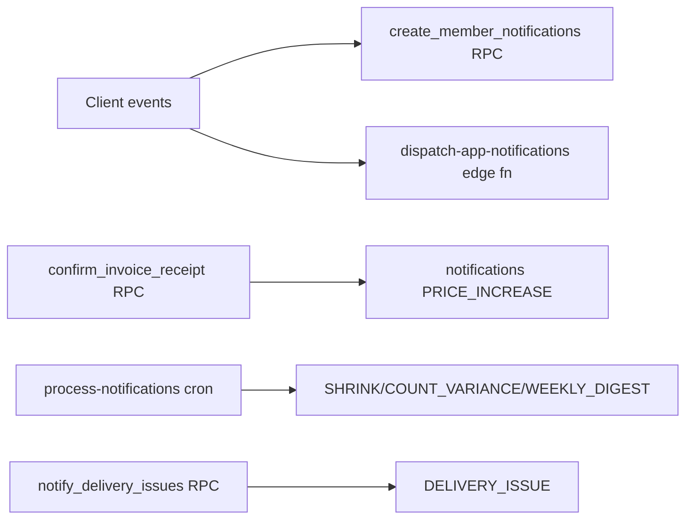

# 08 — Alert and Notification System

---

## Tables

| Table | Purpose |
|-------|---------|
| `notifications` | In-app notifications per user |
| `notification_preferences` | Per-restaurant alert config |
| `alert_recipients` | CUSTOM mode recipient list |
| `reminders` / `reminder_targets` | Scheduled reminders |
| `user_ui_state` | Read state / selections |

**Enum:** `notification_severity` — INFO, WARNING, CRITICAL  
**Enum:** `recipients_mode` — OWNERS_MANAGERS, ALL, CUSTOM

---

## Notification types found in code

| Type | Trigger | Recipient | Data source | Channel | Status |
|------|---------|-----------|-------------|---------|--------|
| `LOW_STOCK` | Count approval | Owners/managers (pref mode) | smart order risk items | In-app (`createMemberNotifications`) | **Working** (code) |
| `PAR_CHANGE_REQUEST` | Staff PAR request in count | Managers | session item | In-app | **Working** (code) |
| `PRICE_INCREASE` | Receipt confirm RPC | Resolved via prefs | invoice line delta | In-app + email (process-notifications) | **Partial** (UI card empty in baseline) |
| `PRICE_DECREASE` | Notifications UI filter | — | — | In-app | **UI only** |
| `DELIVERY_ISSUE` | Issue sheet / notify RPC | Prefs | delivery_issues | In-app | **Partial** |
| `SHRINK_ALERT` | process-notifications cron | Prefs | usage anomaly detection | In-app + email | **Backend** |
| `COUNT_VARIANCE` | process-notifications | Prefs | count anomaly | In-app + email | **Backend** |
| `WEEKLY_DIGEST` | Cron | Subscribed users | Aggregated alerts | Email | **Backend** |
| `COUNT_SUBMITTED` | submit for review | Edge dispatch | session | Email (dispatch-app-notifications) | **Working** (code) |
| `COUNT_APPROVED` | approve session | Edge dispatch | session | Email | **Working** (code) |
| `SMART_ORDER_READY` | approve session | Edge dispatch | run_id | Email | **Working** (code) |

**Client-allowed types** (`createMemberNotifications.ts`): `LOW_STOCK`, `PAR_CHANGE_REQUEST`, price request types — **excludes** server-only types listed above.

---

## Generation paths

---

## Recipient resolution

**Edge function** `process-notifications/index.ts`:
- `resolveRecipients()` — OWNERS_MANAGERS | ALL | CUSTOM from `notification_preferences`
- Respects `email_digest_mode`: IMMEDIATE vs DAILY_DIGEST

**PAR suggestions page** (`PARSuggestions.tsx`): inline recipient logic excluding STAFF for PAR notifications.

---

## Delivery

| Channel | Implementation |
|---------|----------------|
| In-app | `notifications` table; `Notifications.tsx`; header bell via `useNotifications` |
| Email | `send-email`, `margin6Email.ts`, `process-notifications`, `dispatch-app-notifications` |
| Realtime | Migration `20260214040029_realtime_notifications_publication.sql` |

---

## Deduplication

- `notifications_dedupe_within_hour()` — migration `20260522000002_notification_dedup.sql`
- Applied in RPC/trigger paths (server-side)

---

## Read/unread

- `notifications.read_at` column
- `Notifications.tsx` filters and mark-read actions

---

## Security

| Check | Status |
|-------|--------|
| Client creates only allowlisted types | **Yes** — `createMemberNotifications.ts` |
| Server types via RPC/service role | **Yes** |
| RLS on notifications | Member-scoped SELECT (migrations `20260306000003`) |
| process-notifications auth | Fixed in `20260624000002_fix_process_notifications_cron_auth.sql` |
| Tests | `process-notifications-auth.test.ts`, `create-member-notifications.test.ts` |

---

## Failure behavior

- `dispatchAppNotification` try/catch — approval not blocked on email failure (stderr in unit tests)
- Loader failures on dashboard show row-level errors, not silent drop

---

## Gaps vs product intent

- No unified "exception inbox" for owners
- No "resolved/unresolved" money tracking
- Alert card / notification dedup mismatch in baseline
- No location-targeted notification filtering in all paths
